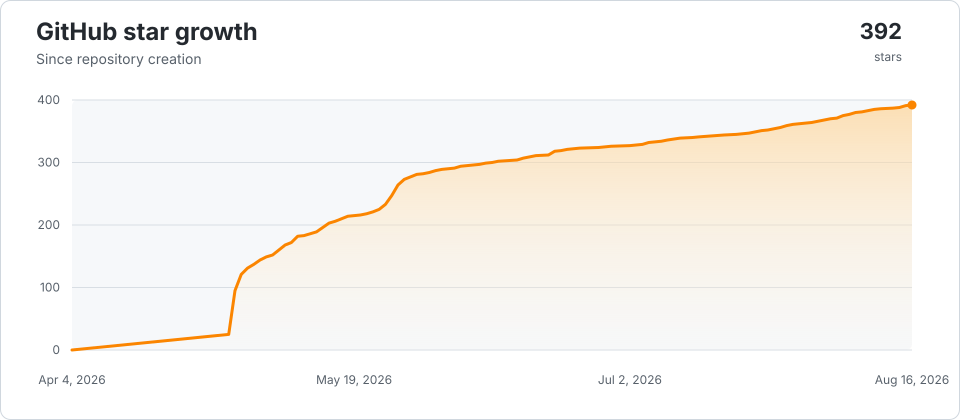
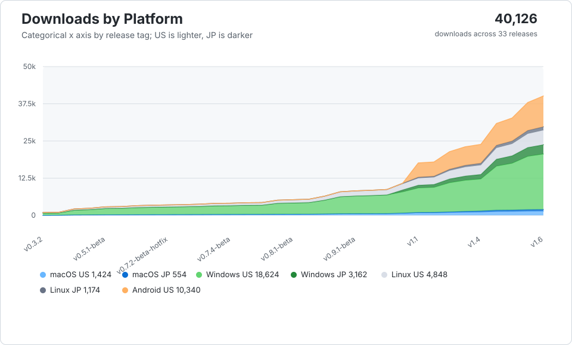

<p align="center">
  
</p>

# BattleShip

> **Work in progress: PS Vita port.** This fork adds an experimental PS Vita target
> (`Makefile.vita`, a standalone VitaSDK build alongside the CMake build the other
> platforms use) on top of upstream BattleShip. **Video and audio are confirmed
> working on real hardware** (and Vita3K) after root-causing a chain of boot-time
> bugs — `SceShaccCg` shader-compiler heap starvation, a broken frame-presentation
> path, and a stale texture-cache comparison — written up in
> [`docs/bugs/`](docs/bugs/). Still under active debugging; crashes during a full
> playthrough are expected, and at least one crash (a zlib/NEON issue) is still
> open. A GitHub Actions workflow on the `ci/vita-vpk-build` branch builds an
> installable VPK from a clean checkout, no local VitaSDK setup required. See
> [Building for PS Vita](#building-for-ps-vita) below.

**BattleShip** is a PC port of **Super Smash Bros. (N64)** — both the **US** (NTSC-U v1.0) and **Japanese** (Nintendo All-Star! Dairantou Smash Brothers) releases — built on top of the [VetriTheRetri/ssb-decomp-re](https://github.com/vetritheretri/ssb-decomp-re) decompilation, using [libultraship](https://github.com/Kenix3/libultraship) for PC-native rendering / audio / input and [Torch](https://github.com/HarbourMasters/Torch) for extracting assets out of the ROM at build time.

Runs natively on macOS (Apple Silicon), Linux, Windows, Android, and (WIP) PS Vita.

Download the high resolution texture pack from [GhostlyDark](https://github.com/GhostlyDark) [here!](https://evilgames.eu/texture-packs/ssb-reloaded.htm#pc)

## No copyrighted assets are included in this repository

**None of Nintendo's assets (code, textures, audio, models, text, ROM data) are checked into this repo or distributed with builds.** The port is a pure C/C++ source tree; every byte of Nintendo-owned data is extracted at build time from a ROM that *you* supply. If you do not own a legal copy of Super Smash Bros. for the Nintendo 64, you cannot build or run this project.

You supply your own ROM. The decomp game code is region-compiled, so US
and JP are separate builds — build the one matching your ROM
(`-DSSB64_VERSION=us|jp`, see [BUILDING.md](BUILDING.md)). The canonical,
supported dumps (internal name `SMASH BROTHERS`):

| Version | Game code | SHA‑1 | MD5 |
|---------|-----------|-------|-----|
| **US** — NTSC-U v1.0 | `NALE` | `e2929e10fccc0aa84e5776227e798abc07cedabf` | `f7c52568a31aadf26e14dc2b6416b2ed` |
| **JP** — Nintendo All-Star! Dairantou Smash Brothers v1.0 | `NALJ` | `4b71f0e01878696733eefa9c80d11c147ecb4984` | `66db457b130d31a286a23d6e4dd9726e` |

If your dump does not match the hashes for its version, it will not work.

## Project stats

<p align="center">
  <picture>
    <source media="(prefers-color-scheme: dark)" srcset="assets/readme-stats/star-growth-dark.svg">
    <source media="(prefers-color-scheme: light)" srcset="assets/readme-stats/star-growth-light.svg">
    
  </picture>
</p>

<p align="center">
  <picture>
    <source media="(prefers-color-scheme: dark)" srcset="assets/readme-stats/release-downloads-dark.svg">
    <source media="(prefers-color-scheme: light)" srcset="assets/readme-stats/release-downloads-light.svg">
    
  </picture>
</p>

<p align="center">
  <sub>Charts are generated by GitHub Actions. Downloads are split by platform and ROM region; GitHub exposes current per-asset totals, not per-download timestamps.</sub>
</p>

## Features

Everything below is toggleable in-game from the ESC menu.

### Input enhancements (per-player)

- **Disable Tap Jump**
- **C-Stick Smash**
- **D-Pad to Jump**
- **NRage analog-stick remap** with customizable per-axis ranges

### Gameplay & match options

- **Classic Co-op** — play the originally single-player Classic mode with 2-player local co-op, with an optional friendly-fire toggle
- **Z-Cancel assists** — Auto Z-Cancel and Flash on Failed Z-Cancel (L-cancel practice aids)
- **Competitive ruleset** — one-click tournament rules, plus neutral spawns on Dream Land
- **Disable Stage Hazards**
- **Hitbox view** — visualize hitboxes / hurtboxes / collision
- **Boot straight to the VS character-select screen**, **Skip Results Screen**, **Force CPU Level 9**
- **Unlocks** — unlock everything, or individual characters (Captain Falcon, Jigglypuff, Luigi, Ness) and features (Mushroom Kingdom, Item Switch menu, Sound Test)

### Audio

- **Music shuffler** — randomize stage BGM
- **Music selection screen** — pick the track per stage
- Independent Master / Music / Sound / Voice volume sliders

### Rendering (powered by libultraship / Fast3D)

- Internal resolution scaling, MSAA anti-aliasing, three-point texture filtering
- Full widescreen support, including ultrawide resolutions.
- Renderer backend selection (OpenGL / Metal / Direct3D), VSync, windowed-fullscreen, multi-window
- **Post-process shader support** with an in-app shader-pack downloader

### Textures & mods

- **Hi-res texture packs** on desktop *and* Android (opt-in, read in place straight out of a `.zip`). Download GhostlyDark's pack from [evilgames.eu](https://evilgames.eu/texture-packs/ssb-reloaded.htm#pc).
- **Native C mod support** — write mods in C, compiled at runtime (TinyCC), with hot-reload, function detours, and a documented engine/fighter event catalog. See [`docs/modding.md`](docs/modding.md). *(Desktop only; scripting is disabled on Android.)*

### Controls

- Controller and rumble support powered by **SDL2**, with plug-and-play routing for up to 4 pads
- Native **Raphnet** adapter support up to 4 channels through **hidapi**
- Per-controller configuration UI and a bundled `gamecontrollerdb.txt` mapping database

### Platform & quality-of-life

- Runs natively on **macOS (Apple Silicon), Linux, Windows, and Android**
- First-run ROM-extraction wizard, built-in update checker/downloader, and Discord Rich Presence

### Rollback netcode & online play

Work in progress on the desktop platforms.

**PS Vita** (as of 1.3): local ad-hoc **and** online netplay with predictive
rollback, host-configurable match rules, optional self-hosted matchmaking and
UPnP automatic port forwarding. See
[Playing online (PS Vita)](#playing-online-ps-vita) and the
[changelog](CHANGELOG.md).

## Author's notes

### About the project

This is a project that I started and developed alone with Claude until the v0.3-beta release. It took a little over a month of night and day work to get to the first beta release, and a massive 4 day long sprint working all day resolving bugs from v0.3-beta to v0.7-beta. As of now, this is no longer a pure AI project. Many people have offered their time playtesting, their knowledge of the game, or their experience with modding or competitive play; to bring improvements, bug fixes, new feature suggestions, and additions. Without them, the project would not be what it is today.

If you find anything that you would like to see improved, create an issue on Github. I'll fix it.

This port was started when the original decomp was 96% complete code only. The remaining 4% was the internal debug menu and Libultra functions that aren't necessary to port the game. The relocatable data was also not decompiled at the time. The port was designed with this in mind, and it is why certain design decisions had to have been made. I like to move fast, obviously.

This project uses a heavily modified LibUltraShip and Torch, those two modules obviously don't work with every n64 game out of the box and a lot of game specific things needed to be implemented. The original game is quite unique and uses rendering techniques and n64 hardware tricks in ways other LUS projects did not need to account for.

This is a passion project for me. Not out of nostalgia, but to actually make something. I don't have too much nostalgia for the original game, considering I didn't own a copy as a kid, but I remember playing it at a friend's house a handful of times. What motivates me to work on this is because I can. Because it's hard, because it hasn't been done before (at least not open source). It's required a ton of my personal time, even using AI. It's forced me to get creative, to design custom tools, to force the agents into certain boxes.

People may not like it because I used AI, and that's okay. I'm not going to argue with your opinion or try to say that my way is the correct way of doing things. It works for me and that's what matters to me. My code is open source, it's free, it's MIT Licensed, and everyone can learn from it. That's what should matter to you.

I hope you enjoy the project.

---

## Building

If you want to manually compile BattleShip, please consult the [building instructions](BUILDING.md).

### Building for PS Vita

The PS Vita target is **work in progress** — video and audio are confirmed working
on real hardware, but crashes during a full playthrough are expected and at least
one (zlib/NEON-related) is still open, see [`docs/bugs/`](docs/bugs/). It uses a
standalone `Makefile.vita` instead of the CMake build the other platforms use —
VitaSDK's toolchain doesn't fit this project's CMake setup cleanly, so the Vita
build is hand-rolled to mirror what CMakeLists.txt does for every other platform.

#### Option A: download a build from CI (no VitaSDK setup needed)

The `ci/vita-vpk-build` branch carries a GitHub Actions workflow
(`.github/workflows/vita-vpk-build.yml`) that builds `battleship.vpk` from a clean
checkout inside the `vitasdk/vitasdk` container image — the same environment this
section's manual steps describe, just automated. Run it via **Actions → Vita VPK
Build → Run workflow** (or `gh workflow run "Vita VPK Build" --ref ci/vita-vpk-build`)
and download the `battleship-vpk` artifact from the finished run. You still need
your own ROM (see above) and to extract `BattleShip.o2r` yourself — CI never touches
copyrighted assets.

#### Option B: build locally

Prerequisites:

- [VitaSDK](https://vitasdk.org) installed, with `$VITASDK` pointing at it and
  `$VITASDK/bin` on your `PATH` (needed for `vita-make-fself`, `vita-mksfoex`,
  `vita-pack-vpk`, `vita-elf-create`).
- A locally-built vitaGL, **not** vitasdk's packaged one — this codebase calls the
  older 3-argument `vglDrawObjects(mode, count, implicit_wvp)` form, which current
  upstream vitaGL dropped in favor of a 2-argument signature. `Makefile.vita`'s
  `VITAGL_DIR` variable points at a machine-specific path
  (`~/.local/opt/vitadb-deps/vitaGL-nosplash` on the primary dev machine) and will
  need adjusting to wherever your own checkout lives. That checkout also needs one
  source patch before building: [Rinnegatamante/vitaGL](https://github.com/Rinnegatamante/vitaGL)
  master has `#ifdef HAVE_PTRHEAD` (letters transposed) in `source/gxm.c`'s
  GC-thread setup instead of `HAVE_PTHREAD`, plus a missing `#include <pthread.h>`
  that typo was masking — fix both, then rebuild with
  `HAVE_PTHREAD=1 LOG_ERRORS=1 HAVE_GLSL_TEXTURE_SIZE=1 INDICES_SPEEDHACK=1 NO_SPLASHSCREEN=1`
  (see the CI workflow's "Build vitaGL (patched)" step for the exact `sed` used).
- The same ROM/asset requirements as every other platform (see above) — the Vita
  build does not extract assets on-device; extract `BattleShip.o2r` with `torch` on
  desktop first (same as the other platforms) and copy it to
  `ux0:data/battleship/BattleShip.o2r` on the memory card before first launch.

Build:

```sh
export VITASDK=/usr/local/vitasdk   # wherever your VitaSDK install lives
export PATH="$VITASDK/bin:$PATH"

make -f Makefile.vita objects
make -f Makefile.vita prepare
make -f Makefile.vita build/battleship.vpk
```

This produces `build/battleship.vpk` (plus the intermediate `build/battleship.elf`,
`build/battleship.velf`, `build/eboot.bin`, etc.) — install it with VitaShell or run
it directly under [Vita3K](https://vita3k.org). Everything under `build/` is
generated and gitignored; nothing there is checked into the repo.

#### Generating and installing the required data (BattleShip.o2r + assets)

The VPK is just the engine — **it ships no game data.** Same rule as every other
platform (see [above](#no-copyrighted-assets-are-included-in-this-repository)):
you supply your own legally-owned ROM, and every byte derived from it is
generated locally, never distributed with the port. The Vita build additionally
does **not** extract on-device (there's no equivalent of the desktop first-run
wizard here — see [`docs/architecture.md`](docs/architecture.md) for why), so this
has to happen on your dev machine first, then be copied onto the memory card.

1. **Generate the data**, from the repo root, with your own ROM:

   ```sh
   scripts/extract-vita-data.sh /path/to/baserom.us.z64
   ```

   This builds a one-off host copy of `torch` (cached afterwards under
   `build-torch-host/` so repeat runs are instant), extracts `BattleShip.o2r`,
   and derives the extra-stage CSS icon PNGs
   (`tools/derive_stage_assets.py`) — all laid out under
   `dist/vita-data-deploy/ux0/data/battleship/`, mirroring the Vita's own
   app-data path exactly, plus a matching `dist/vita-data-deploy.zip`.

2. **Copy that onto the memory card** at `ux0:data/battleship/`, so you end up
   with:

   ```
   ux0:data/battleship/BattleShip.o2r
   ux0:data/battleship/assets/css_icons/*.png
   ```

   Any transfer method works (VitaShell's built-in FTP/USB, a memory-card
   reader, etc.). If you're iterating with
   [vitacompanion](https://github.com/devnoname120/vitacompanion) already
   running (see [`CLAUDE.md`](CLAUDE.md)'s PS Vita Port section), the same FTP
   server on port 1337 will take it too:

   ```sh
   curl -T dist/vita-data-deploy/ux0/data/battleship/BattleShip.o2r \
     "ftp://$VITA_IP:1337/ux0:/data/battleship/BattleShip.o2r"
   ```

3. **Install and launch `battleship.vpk`.** With the data already in place, the
   only thing left is the one-time shader prewarm described next.

**First launch is slow on purpose.** Before any gameplay, the Vita build
precompiles every Fast3D shader combination observed across a full boot/attract
capture (`SceShaccCg`'s runtime compiler becomes unreliable once the game's own
assets have consumed enough of the process heap — compiling everything early,
while heap is still small, sidesteps that). This first-run prewarm can take two to
three minutes and shows a progress bar; successful programs are then cached to
`ux0:data/battleship/shader_cache`, so subsequent launches load them from disk
instead of recompiling. Don't interrupt the app during this window — let the
progress bar finish once.

### Controls (PS Vita)

Default layout, modelled on the SSB64 3DS port (the Vita has no analog triggers):

| Physical | N64 | Notes |
|---|---|---|
| Circle | A — attack | |
| Cross | B — special | |
| Triangle / Square | C-Up / C-Left (jump) | |
| L | R-Trigger — grab | |
| R | Z-Trigger — shield | |
| Start | Start / pause | |
| Left stick | N64 control stick | |
| Right stick | C-buttons; **flick = taunt** in gameplay | forced by the port |
| D-pad | menu navigation; in gameplay it emulates the left stick (up/down = jump/crouch, tap left/right = walk, double-tap = dash) | forced by the port |
| Select | opens the in-game menu | |

**Remapping.** The in-game controller editor is disabled on the Vita build (its
"press a button" capture flow doesn't work with the port's `sceCtrl`-forced
input), so remapping is done by hand in the config file.

The bindings live in `ux0:data/battleship/BattleShip.cfg.json` (created on first
launch). Pull it over FTP with vitacompanion, edit, push it back, relaunch. It
must stay valid JSON.

A ready-to-edit copy of the default layout is checked in at
[`port/vita/BattleShip.cfg.controller-template.json`](port/vita/BattleShip.cfg.controller-template.json) —
either drop it in whole as `BattleShip.cfg.json`, or merge just its
`CVars.gControllers` object into your existing file.

The button bindings are under `CVars → gControllers → ButtonMappings`. Each entry
looks like:

```json
"CVars": {
  "gControllers": {
    "ButtonMappings": {
      "P0-B32768-SDLB1": {
        "ButtonMappingClass": "SDLButtonToButtonMapping",
        "Bitmask": 32768,
        "SDLControllerButton": 1
      }
    }
  }
}
```

- `Bitmask` — **which N64 button** this entry drives.
- `SDLControllerButton` — **which physical Vita button** triggers it.
- The entry name (`P0-B…-SDLB…`) is just a unique key — **leave it alone**, only
  change the numbers inside.

To remap, edit `SDLControllerButton` (or swap that value between two entries).
To add a second physical button for the same N64 button, duplicate the entry
with a new unique key **and** append that key to the matching
`…ButtonMappingIds` string under `gControllers → Port1 → Buttons`.

| N64 button | `Bitmask` |
|---|---|
| A | 32768 |
| B | 16384 |
| C-Up | 8 |
| C-Down | 4 |
| C-Left | 2 |
| C-Right | 1 |
| R-Trigger (grab) | 16 |
| Z-Trigger (shield) | 8192 |
| Start | 4096 |

| Physical Vita button | `SDLControllerButton` |
|---|---|
| Cross | 0 |
| Circle | 1 |
| Square | 2 |
| Triangle | 3 |
| Start | 6 |
| L | 9 |
| R | 10 |

*Example — swap grab and shield onto the opposite shoulder buttons:* in the entry
with `"Bitmask": 16` set `"SDLControllerButton": 10`, and in the entry with
`"Bitmask": 8192` set `"SDLControllerButton": 9`.

**Two things you can't change here:** the **D-pad** and the **right-stick taunt**
for Player 1 are read straight from the Vita's `sceCtrl` by the port and ignore
this file (this is what lets the D-pad drive menus regardless of an old saved
config). Everything else — face buttons, L/R, Start, both analog sticks — is
editable.

To reset to defaults, delete the `gControllers` block (or the whole file) and
relaunch.

### Playing online (PS Vita)

Netplay lives under **VS MODE → NETPLAY**. First set your name in
**NETPLAY → SETTINGS → PLAYER NAME** (opens the system keyboard).

**Local (same Wi-Fi / PS TV) — no setup:**

1. Both consoles: **VS MODE → NETPLAY → LOCAL ADHOC**.
2. One picks **HOST GAME**, the other **FIND GAME → A** to join. Accept the
   system's ad-hoc connection dialog when it appears.
3. Host presses **R** to set the match rules, both press **A** to ready up,
   host presses **START** → character select → fight.

**Over the internet — direct IP:**

1. Both consoles: **VS MODE → NETPLAY → ONLINE**.
2. **Host** picks **HOST GAME**. The lobby shows:
   - `LOCAL <ip>` — your address on the LAN.
   - `OPENING PORTS` → `PUBLIC <ip>` — the port is asking your router (UPnP) to
     forward `26041/tcp` + `26042/udp` and reporting your public IP.
   - If it can't (UPnP disabled on the router, or you're behind CGNAT), it
     shows `PUBLIC <ip>` with a *"forward 26041 26042"* hint — forward those two
     ports to the host console's LAN IP in your router settings manually.
3. Give the **`PUBLIC` IP** to the other player.
4. **Joiner** picks **DIRECT IP**, types the host's public IP on the system
   keyboard, **A** to connect.
5. From there it's the same as local: **R** for rules, **A** ready, host
   **START**.

A console behind CGNAT (common on mobile / some fibre) can still **join** a
game — it just can't host, because inbound connections never reach it.

**Over the internet — with a lobby board (skip typing IPs):**

Run the tiny matchmaker so joiners can browse open lobbies:

1. On any always-on box (Raspberry Pi, NAS, an old PC) build and run
   `server/matchmaker` (see `server/matchmaker/deploy/README.md`): one Go
   binary, one forwarded TCP port (`26050`), free dynamic-DNS for a stable
   hostname. It stores no game data and never relays traffic — it only lists
   lobbies.
2. Both consoles: **NETPLAY → SETTINGS → SET SERVER** → your board's hostname.
3. Host still needs its gameplay ports reachable (UPnP or manual, as above).
4. **HOST GAME** on one console; **FIND GAME** on the other now lists the
   lobby by name — **A** to join. Gameplay is still a direct connection between
   the two consoles.

## Architecture

The port has three layers and they are kept deliberately separate:

```
┌──────────────────────────────────────────────────────────────┐
│  decompiled game code  (decomp/src/)                         │
│  Unmodified C produced by the decomp project. Talks to the   │
│  N64 the same way the original ROM did: GBI display lists,   │
│  ALSeqPlayer audio, OS threads, OSContPad input.             │
├──────────────────────────────────────────────────────────────┤
│  port layer            (port/)                               │
│  Modern C++ glue. Translates N64-shaped APIs into LUS calls, │
│  fixes endianness on freshly-loaded data, owns Ship::Context │
│  and the resource factories, and quarantines every change    │
│  the decomp doesn't need to know about.                      │
├──────────────────────────────────────────────────────────────┤
│  libultraship         (libultraship/)                        │
│  PC-native runtime: Fast3D renderer (OpenGL / Metal / D3D),  │
│  SDL2 input, miniaudio output, OTR/O2R resource manager,     │
│  ImGui overlay.                                              │
└──────────────────────────────────────────────────────────────┘
```

### Asset pipeline

`baserom.us.z64` is never read at runtime. At build time, **Torch** walks the ROM with the YAMLs under `yamls/us/` and emits `BattleShip.o2r` — a zip-format archive of typed resources (textures, sequences, sample banks, animations, reloc files). At launch, libultraship's resource manager mounts `BattleShip.o2r` + `f3d.o2r` and the port code requests resources by path. This is the same pipeline used by Ship of Harkinian, Starship, SpaghettiKart, etc.

The relocatable-data files (fighter tables, item tables, effects, sprites) are SSB64-specific and required custom factories on the Torch side and a custom loader (`port/resource/RelocFileFactory.cpp`) on the runtime side.

### Build-time codegen

A small amount of generated code lives outside the source tree (gitignored) and is regenerated on every build from `tools/reloc_data_symbols.us.txt`:

- `include/reloc_data.h` — extern declarations for every relocatable symbol
- `yamls/us/reloc_*.yml` — Torch extraction configs
- `port/resource/RelocFileTable.cpp` — the runtime symbol table

If you ever see "undefined reference to `dFooBarReloc`" you regenerated the table without rebuilding, or vice versa.

---

## Code conventions

### `#ifdef PORT` — what it is and what it isn't

Every meaningful change to a decomp source file is wrapped in `#ifdef PORT` / `#else` / `#endif`. The discipline this enforces:

- **The original decomp code path stays intact and compilable** under the IDO toolchain on a real N64 build. This is non-negotiable — if it ever stops being true, upstreaming improvements back to the decomp project becomes impossible.
- **The PORT branch is allowed to be ugly** — an explicit endian conversion, a struct rewrite, a function shim — as long as the contract it presents to the rest of the file is the same as the N64 branch.
- **Reloc tokens vs. raw pointers**: a field declared `u32` under `#ifdef PORT` where the N64 branch declared `T*` is a *reloc token*, not a raw pointer. Resolving it requires `PORT_RESOLVE(token)`. Assigning a real pointer with `(uintptr_t)ptr` will silently truncate on LP64 — wrap post-load writes in `PORT_REGISTER`.

### Decomp preservation: behavior, not bytes

The repo follows a single principle for changes to `decomp/src/`:

> **Accuracy to game behavior > accuracy to ROM bytes.**

That means IDO idioms that encode original N64 semantics — odd casts, `goto` flow, deliberate temporaries — are load-bearing and stay. But **compiler-compat shims** (warning suppressions, permissive flags, header shortcuts) that mask real bugs on modern LP64 toolchains do *not* survive. The most expensive lesson of the project was that `-Wno-implicit-function-declaration` was silently truncating 64-bit pointer returns to 32-bit `int` in dozens of places — see `docs/bugs/item_arrow_gobj_implicit_int_2026-04-20.md`. The shim is gone; the real declarations are in.

### Naming prefixes

The decomp uses two-letter module prefixes throughout. Knowing them makes the source tree navigable:

| Prefix | Meaning |
|--------|---------|
| `ft`   | Fighter (`ftMario`, `ftKirby`, `ftFox`, …) |
| `it`   | Item (`itAttribute`, `itManager`) |
| `wp`   | Weapon |
| `ef`   | Effect / particle |
| `gm`   | Game mode |
| `gr`   | Stage (ground) |
| `mp`   | Map / collision |
| `mn`   | Menu |
| `sc`   | Scene |
| `sy`   | System (engine internals) |
| `sf`   | Saved-state / save file |
| `db`   | Debug |
| `cm`   | Camera |
| `lb`   | Library (low-level utilities) |
| `obj`  | GObj / DObj / OMObj — game-object wrappers |

Full reference: [`docs/c_conventions.md`](docs/c_conventions.md).

### Endianness handling

The N64 is big-endian; PC targets are little-endian. The port handles this in three layers:

1. **Gross byteswap at load** — `lbRelocLoadAndRelocFile` byteswaps relocatable files word-by-word during load.
2. **Per-struct fixups** — small `portFixupStructU16` / `portFixupStructU8` helpers fix sub-word fields that the gross swap got wrong (e.g., `{u16, u8, u8}` patterns where the two `u8`s end up swapped).
3. **Per-stream walkers** — animation events, spline interpolators, and other variable-length streams are halfswapped at file-bake time and need a per-stream un-halfswap on first access. These live in `port/port_aobj_fixup.{h,cpp}` and friends.

If you find a new struct that reads garbage, the playbook in `docs/n64_reference.md` will tell you which layer it belongs in.

### Bitfield layout

The IDO compiler packs small bitfields into preceding `u16` pad gaps, MSB-first. Modern compilers (Clang, GCC) on LE targets pack LSB-first into the next storage unit. Bitfield structs that travel through file data must be **rewritten under `#ifdef PORT`** to match the IDO physical layout — see `docs/debug_ido_bitfield_layout.md` for the workflow (compile + rabbitizer disasm to verify bit positions before porting).

Patching the *reads* in game code instead of the *layout* is forbidden by team policy; the bug always comes back. See `feedback_struct_rewrite_over_overrides.md` in the project's memory for the long version.

---

## Why the submodules are forks

Both `libultraship` and `torch` are pinned to **personal forks** rather than the upstream Harbour Masters repos, because each needs SSB64-specific changes that don't exist upstream.

### [`libultraship`](https://github.com/JRickey/libultraship/tree/ssb64) — fork of [Kenix3/libultraship](https://github.com/Kenix3/libultraship)

SSB64 drives the RDP differently than the Zelda / Mario 64 / Star Fox 64 titles libultraship was originally built for — in particular around tile masks, `SetTileSize` extents, IA/I4 texture uploads, `gDPSetPrimDepth` for 2D layering, and Metal sampler binding for matanim CCs. Upstreaming the fixes is on the list, but until then the fork carries:

- Clamping `ImportTexture*` upload width/height to the active `SetTileSize` extent (fixes the fighter "black squares" bug and the IA8/I4 stretch bug)
- Honouring `SetTile` mask/maskt in the Import* path
- A real implementation of `gDPSetPrimDepth` (was a `TODO Implement` stub upstream — broke every `G_ZS_PRIM` 2D sprite)
- A 1×1 black fallback texture for sampler slots that would otherwise alias the screen drawable on Metal (fixed the Whispy canopy stripe)
- A no-logging path in `IResource`'s destructor to prevent a shutdown-time crash

### [`torch`](https://github.com/JRickey/Torch/tree/ssb64) — fork of [HarbourMasters/Torch](https://github.com/HarbourMasters/Torch)

Torch is the tool that reads the ROM and emits `BattleShip.o2r`. Upstream supports OoT, MM, SF64, MK64, PM64, etc., but has no knowledge of SSB64's file formats. The fork adds:

- An `SSB64` build flag and game target
- A reloc-file factory for SSB64's relocatable data blobs (fighters, items, effects, sprites)
- `libvpk0` integration for VPK0-compressed segments

Both forks live as submodules so their history stays their own and so upstream changes can be merged in cleanly when/if the fixes are accepted.

### PS Vita re-forks: a further layer on top

The Vita port needed real source changes beyond what any of the forks above
already carry, so `decomp`, `libultraship`, and `torch` are each forked *again*
onto a personal fork-of-a-fork, tracked in `.gitmodules` by a `vita-*`-prefixed
branch:

- **[`decomp`](https://github.com/robin994/ssb-decomp-re-vita/tree/vita-compat-fixes)**
  — fork of [VetriTheRetri/ssb-decomp-re](https://github.com/vetritheretri/ssb-decomp-re).
  Carries a `stddef.h` shim for VitaSDK's partial `__need_wint_t` support, commits
  the US credits-text assets `tools/creditsTextConverter.py` normally generates at
  CMake configure time (`Makefile.vita` has no equivalent codegen step, so these
  need to already exist in the tree for a from-scratch build), and gates several
  always-on diagnostic `port_log()` calls behind the existing
  `PORT_RUNTIME_DIAGNOSTICS` convention instead of paying their cost on every
  release build.
- **[`libultraship`](https://github.com/robin994/libultraship-vita/tree/vita-rinne-merge)**
  — fork of [`JRickey/libultraship`](https://github.com/JRickey/libultraship/tree/ssb64)
  (itself the fork described above). Vita-only additions include: exact-size VBO
  scratch allocation instead of a fixed 10 MiB reservation (the fixed block was
  starving vitaGL's shared scratch pool), rendering directly into vitaGL's own
  display framebuffer and swapping via `vglSwapBuffers()` instead of
  `SDL_GL_SwapWindow()` (stock SDL2's Vita driver presents its own surface, not
  vitaGL's), a fixed 960×544 window size (VitaSDK SDL2 reports 0×0 from its
  window/drawable-size queries), the early per-shader prewarm hook
  (`RunEarlyShaderSelfTest`), a validated on-disk shader program-binary cache
  (replacing an unsafe one that data-aborted on real hardware), a
  `TextureCacheKey` equality fix (was comparing uninitialized struct padding via
  `memcmp`), and periodic aggregate perf counters (Fast3D command walk/run time,
  draw/VBO timing, texture-cache hit rate).
- **[`torch`](https://github.com/robin994/Torch/tree/vita-compat-fixes)** — fork of
  [`JRickey/Torch`](https://github.com/JRickey/Torch/tree/ssb64) (itself the fork
  described above). Currently just gitignores the `*.o`/`*.d` build artifacts
  `Makefile.vita`'s in-tree compilation leaves scattered through the source tree.

---

## Repo layout

```
port/         modern C++ port layer — Ship::Context, resource factories,
              endian fixups, bridges between decomp code and libultraship
                port/hooks/     engine/fighter event system (all platforms)
                port/mods/      native C mod loader + hook backend (funchook)
workspace/    worked example mods (hooktest, playertint, template)
include/      headers (some generated: reloc_data.h)
decomp/       submodule — decompiled SSB64 C source (largely unchanged
              game logic). Major subdirs inside the submodule:
                src/sys/        main loop, DMA, scheduling, audio,
                                controllers, threading
                src/ft/         fighters (ftmario/, ftkirby/, ftfox/, …)
                src/sc/ gm/ gr/ scene / game modes / stage rendering
                src/mn/ it/ ef/ menus / items / effects
                src/relocData/  reloc data sources
libultraship/ submodule — PC-native render / audio / input / resource mgr
torch/        submodule — asset extractor (ROM → BattleShip.o2r)
yamls/us/     Torch YAML extraction configs (some generated)
tools/        Python helpers: reloc stubs, YAML gen, credits encoder
docs/         architecture notes, bug write-ups, debugging guides
debug_tools/  optional disasm / diff utilities (not required for a build)
scripts/      packaging (.dmg / .AppImage / .zip), worktree helper
```

### Further reading

- [`docs/modding.md`](docs/modding.md) — writing native C mods: the event catalog, function detours, and fighter override points
- [`docs/architecture.md`](docs/architecture.md) — project status, ROM info, dependency map, source-tree layout
- [`docs/c_conventions.md`](docs/c_conventions.md) — decomp naming prefixes, IDO idioms to preserve, code style, macros
- [`docs/n64_reference.md`](docs/n64_reference.md) — RDRAM, RSP/RDP, GBI, audio, threading, endianness primer
- [`docs/build_and_tooling.md`](docs/build_and_tooling.md) — CMake details, reloc stub regen, runtime logs, LP64 compat notes
- [`docs/debug_gbi_trace.md`](docs/debug_gbi_trace.md) — capturing GBI traces from the port and a M64P plugin, diffing with `gbi_diff.py`
- [`docs/debug_ido_bitfield_layout.md`](docs/debug_ido_bitfield_layout.md) — verifying ported struct bit positions against IDO output via rabbitizer
- [`docs/bugs/README.md`](docs/bugs/README.md) — index of resolved bugs with per-bug root-cause and fix write-ups (~45 entries)

---

## Contributing

PRs are welcome from anyone. If you're opening a bug report, the most useful things to include are:

- SHA-1 of your `baserom.us.z64`
- OS + architecture (especially macOS ARM64 vs x86_64, since LP64 bitfield layout has bitten us several times — see `docs/bugs/`)
- The contents of `ssb64.log` from the run that reproduces the issue
- A GBI trace if the issue is rendering-related (see `docs/debug_gbi_trace.md`)

## Credits & licensing

- Game code, data, sound, textures, models, and trademarks: **© Nintendo / HAL Laboratory.** Not included in this repository, not redistributed, and not endorsed by them.
- Decompilation: [VetriTheRetri/ssb-decomp-re](https://github.com/VetriTheRetri/ssb-decomp-re) and its contributors. Vendored as the `decomp/` submodule. At the time of writing the upstream project does not publish an explicit license; this repository makes no copyright claim over the decompiled source and refers to the upstream project for any rights, terms, or restrictions on reuse.
- Runtime framework: [libultraship](https://github.com/Kenix3/libultraship) — Copyright (c) 2022 kenix3, MIT-licensed. Originated by the Harbour Masters team (Ship of Harkinian) and now maintained at Kenix3/libultraship. Vendored as the `libultraship/` submodule.
- Asset pipeline: [Torch](https://github.com/HarbourMasters/Torch) — Copyright (c) 2023 Lywx (Harbour Masters), MIT-licensed. Vendored as the `torch/` submodule.
- Menu fonts: [Montserrat](https://github.com/JulietaUla/Montserrat) and [Inconsolata](https://github.com/cyrealtype/Inconsolata), both bundled under the [SIL Open Font License 1.1](https://openfontlicense.org). License texts ship alongside the font files in [`assets/custom/fonts/`](assets/custom/fonts/).
- Controller mappings: [`gamecontrollerdb.txt`](gamecontrollerdb.txt) from the [SDL_GameControllerDB](https://github.com/mdqinc/SDL_GameControllerDB) project — bundled with every build and loaded at startup so more controllers work out of the box. Distributed under the zlib license; full text in [`LICENSE`](LICENSE).
- High-resolution texture pack: *SSB Reloaded* by [GhostlyDark](https://github.com/GhostlyDark), distributed separately at [evilgames.eu](https://evilgames.eu/texture-packs/ssb-reloaded.htm#pc). Not bundled with this repository or its builds — the port loads it only if you download it yourself.
- Reference ports I learned from and adapted code from: [Starship](https://github.com/HarbourMasters/Starship) (SF64) and [Ship of Harkinian](https://github.com/HarbourMasters/Shipwright) (OoT) — both MIT-licensed by The Harbour Masters; see [`LICENSE`](LICENSE) for the per-file attribution.
- Reference ports I learned from but did not borrow code from: [SM64 PC Port](https://github.com/sm64-port/sm64-port) (SM64), [SpaghettiKart](https://github.com/HarbourMasters/SpaghettiKart) (MK64).
- Port work: me ([JRickey](https://github.com/JRickey)), with an enormous amount of help, debugging, and feature suggestions from contributors in our Discord server.

### PS Vita port credits

The PS Vita target (this fork — see [PS Vita re-forks](#ps-vita-re-forks-a-further-layer-on-top)
above) has its own additional thanks:

- **[Rinnegatamante](https://github.com/Rinnegatamante)** — for support throughout PS Vita
  development. The rendering layer builds on his [vitaGL](https://github.com/Rinnegatamante/vitaGL)
  fork and Vita-patched `libultraship` rendering backend (see the `libultraship`
  re-fork notes above), plus the memory-pressure tuning (`vglSetParamBufferSize`,
  double- instead of triple-buffering) documented in `CLAUDE.md`'s PS Vita Port section.
- **Standard-Republic** — for the LiveArea assets (`livearea/icon0.png`, `bg.png`,
  `startup.png`, `template.xml`) bundled into `battleship.vpk`.
- Development support for the PS Vita port was a mix of [Claude](https://claude.ai)
  and [Codex](https://openai.com/codex) working alongside real-hardware testing —
  see `CLAUDE.md`'s PS Vita Port section for the current handoff notes and hard-won
  hardware findings those sessions left behind.

This project is **not affiliated with, endorsed by, or authorized by Nintendo.** It is a personal, non-commercial research and preservation effort. Do not upload ROMs, extracted `.o2r` archives, or any other Nintendo-owned data to issues or pull requests.

This project is **not affiliated with, endorsed by, or authorized by Harbour Masters** either. It uses libultraship (originated by the Harbour Masters team and now maintained at [Kenix3/libultraship](https://github.com/Kenix3/libultraship)) and Torch (the [HarbourMasters/Torch](https://github.com/HarbourMasters/Torch) asset extractor) as upstream dependencies via personal forks, but it is an independent fan effort. Issues, bugs, and support questions about this port should not be directed to the Harbour Masters team.

## License

Source code in this repository (everything outside the `decomp/`, `libultraship/`, and `torch/` submodules — each of which carries its own attribution) is released under the [MIT License](LICENSE) — free to use, modify, and redistribute, with no warranty and no liability. See [`LICENSE`](LICENSE) for the full text.

The MIT grant covers only the port-specific code (the `port/` layer, build scripts, tools, docs). It does **not** extend to:
- Game assets, code, audio, textures, models, or any other content owned by Nintendo / HAL Laboratory — none of which is in this repository.
- The decompilation vendored as the `decomp/` submodule, sourced from [VetriTheRetri/ssb-decomp-re](https://github.com/VetriTheRetri/ssb-decomp-re). The upstream project does not currently publish an explicit license; this repository makes no copyright claim over the decompiled source and incorporates it by reference. Defer to the upstream project and its contributors for any rights or restrictions on reuse.
- Decomp-derived content elsewhere in the tree (vendored or auto-generated from the decomp's symbol/file-name tables): `tools/reloc_data_symbols.us.txt`, `tools/relocFileDescriptions.us.txt`, `include/reloc_data.h`, `port/resource/RelocFileTable.cpp`, and `yamls/us/reloc_*.yml`. These follow the same upstream-deference as the `decomp/` submodule. The generator scripts that produce them (`tools/generate_*.py`) are port-authored and remain MIT.
- The `libultraship` submodule — Copyright (c) 2022 kenix3, MIT-licensed (originated by the Harbour Masters team).
- The `torch` submodule — Copyright (c) 2023 Lywx (Harbour Masters), MIT-licensed.
- The bundled menu fonts under `assets/custom/fonts/`, which are licensed under the SIL Open Font License 1.1 (per-font license files in that directory).
- The bundled controller-mapping database `gamecontrollerdb.txt`, from the [SDL_GameControllerDB](https://github.com/mdqinc/SDL_GameControllerDB) project — distributed under the zlib license. Full text and attribution in [`LICENSE`](LICENSE).
